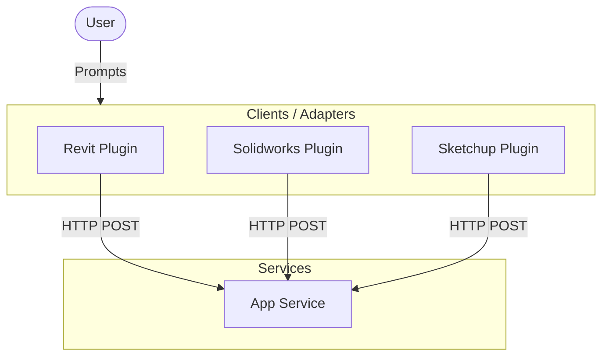

```mermaid
graph TD
    User([User])

    subgraph Clients["Clients / Adapters"]
        revit["Revit Plugin"]
        solidworks["Solidworks Plugin"]
        sketchup["Sketchup Plugin"]
    end

    subgraph Services["Services"]
        app["App Service"]
    end

    User -->|Prompts| Clients
    revit -->|HTTP POST| app
    solidworks -->|HTTP POST| app
    sketchup -->|HTTP POST| app
```
