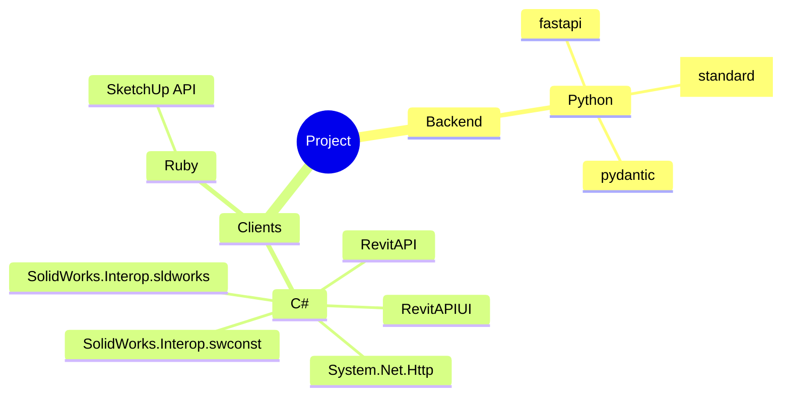

```mermaid
mindmap
  root((Project))
    Backend
      Python
        fastapi
        uvicorn[standard]
        pydantic
    Clients
      C#
        RevitAPI
        RevitAPIUI
        System.Net.Http
        SolidWorks.Interop.sldworks
        SolidWorks.Interop.swconst
      Ruby
        SketchUp API
```
